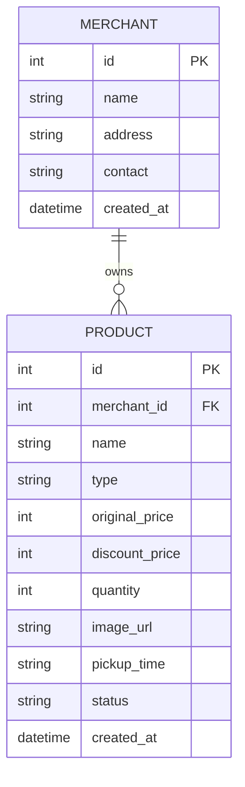

# DB Design Document - 剩食商品上架與搜尋系統

## 1. ER 圖（實體關係圖）

## 2. 資料表詳細說明

### MERCHANT (商家) 資料表
| 欄位名稱 | 型別 | 說明 |
| --- | --- | --- |
| `id` | INTEGER | Primary Key，自動遞增 |
| `name` | TEXT | 商家名稱，必填 |
| `address` | TEXT | 商家地址，必填 |
| `contact` | TEXT | 聯絡方式，選填 |
| `created_at` | TEXT | 建立時間 (ISO 8601)，預設為當下時間 |

### PRODUCT (商品) 資料表
| 欄位名稱 | 型別 | 說明 |
| --- | --- | --- |
| `id` | INTEGER | Primary Key，自動遞增 |
| `merchant_id` | INTEGER | Foreign Key，對應商家 id，必填 |
| `name` | TEXT | 商品名稱，必填 |
| `type` | TEXT | 商品分類（如：便當、麵包、生鮮），必填 |
| `original_price`| INTEGER | 原價，選填 |
| `discount_price`| INTEGER | 優惠特價，必填 |
| `quantity` | INTEGER | 剩餘數量，必填 |
| `image_url`| TEXT | 圖片相對路徑，存於 uploads 資料夾 |
| `pickup_time`| TEXT | 領取時間（例如：17:00-18:00），必填 |
| `status` | TEXT | 商品狀態（上架、下架、已售完），預設為上架 |
| `created_at` | TEXT | 建立時間 (ISO 8601) |

## 3. SQL 建表語法
儲存於專案的 `database/schema.sql`，並於啟動時初始化資料庫。

## 4. Python Model 程式碼
儲存於 `app/models/merchant_model.py` 與 `app/models/product_model.py`。
採用 `sqlite3` 操作。
