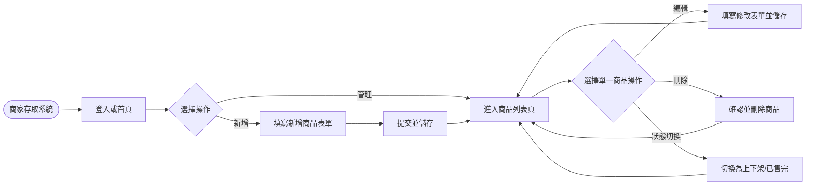
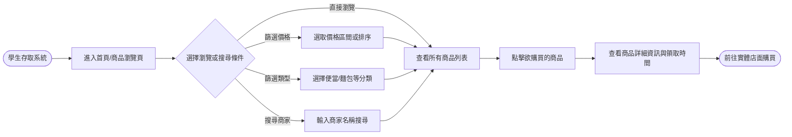
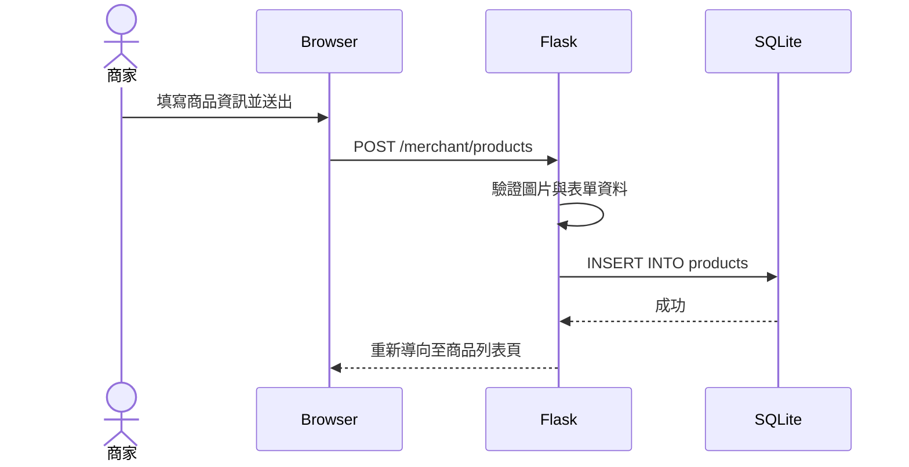
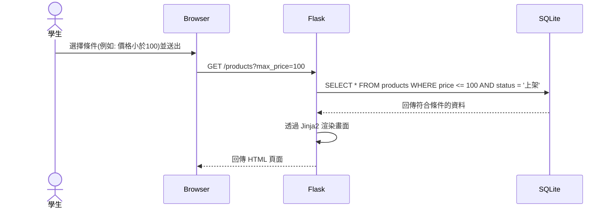

# Flowchart - 剩食商品上架與搜尋系統

## 1. 使用者流程圖 (User Flow)

### 商家端流程 (Merchant Flow)

### 學生/消費者端流程 (Consumer Flow)

## 2. 系統序列圖 (Sequence Diagram)

### 商家新增商品流程

### 學生搜尋與篩選流程

## 3. 功能清單對照表

| 功能名稱 | 角色 | URL 路徑 | HTTP 方法 | 說明 |
| --- | --- | --- | --- | --- |
| 瀏覽所有商品 | 學生 | `/products` | GET | 列出所有上架的剩食商品，支援 query parameters 篩選 |
| 商品詳細資訊 | 學生 | `/products/<id>` | GET | 查看特定商品的詳細資訊 |
| 商家商品列表 | 商家 | `/merchant/products` | GET | 商家檢視自己上架的所有商品 |
| 新增商品畫面 | 商家 | `/merchant/products/new` | GET | 顯示新增表單 |
| 送出新增商品 | 商家 | `/merchant/products` | POST | 接收表單並存入資料庫 |
| 修改商品畫面 | 商家 | `/merchant/products/<id>/edit` | GET | 顯示預先填好資料的修改表單 |
| 送出修改商品 | 商家 | `/merchant/products/<id>/edit` | POST | 更新資料庫中的商品資訊 |
| 刪除商品 | 商家 | `/merchant/products/<id>/delete` | POST | 從資料庫刪除或標記為刪除 |
