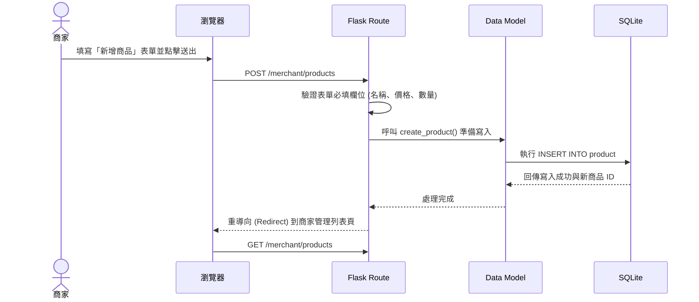
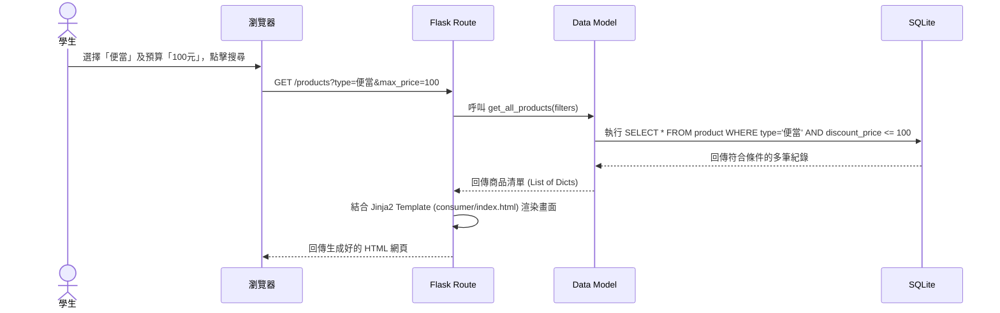

# 系統流程圖文件 (FLOWCHART) - 剩食商品上架與搜尋系統

## 1. 使用者流程圖（User Flow）

以下流程圖展示了本系統中兩大主要角色（**消費者/學生** 與 **商家**）的操作路徑。

```mermaid
flowchart LR
    A([使用者開啟網頁]) --> B{您是哪種身分？}
    
    %% 學生端的流程
    B -->|學生 (預設首頁)| C[首頁 - 商品瀏覽與搜尋]
    C --> D{要執行什麼操作？}
    D -->|瀏覽所有產品| E[檢視所有上架商品清單]
    D -->|設定篩選條件| F[選擇價格、類型、商家並送出]
    F --> E
    E -->|點擊查看詳情| G[商品詳細資訊與領取時間]
    G --> H([前往實體店面])
    
    %% 商家端的流程
    B -->|商家| I[商家後台 - 商品管理列表]
    I --> J{要執行什麼操作？}
    J -->|發布新商品| K[填寫商品表單]
    K -->|送出| I
    J -->|修改資訊| L[編輯商品資訊表單]
    L -->|送出儲存| I
    J -->|切換上下架| M[快速狀態切換]
    M --> I
    J -->|刪除商品| N[確認並刪除]
    N --> I
```

## 2. 系統序列圖（Sequence Diagram）

以下序列圖描述了「商家發布新商品」以及「學生篩選商品」這兩個核心功能，從使用者點擊到資料存入/讀取資料庫的完整互動流程。

### 商家發布新商品流程


### 學生依價格與類型篩選商品流程


## 3. 功能清單對照表

本表列出系統中所有主要功能對應的 URL 路徑與 HTTP Request 方法，供前後端開發人員參考。

| 功能模組 | 功能名稱 | URL 路徑 | HTTP 方法 | 說明 |
| --- | --- | --- | --- | --- |
| **首頁** | 身分跳轉 | `/` | GET | 網站進入點，預設引導至學生的商品列表 |
| **學生端** | 瀏覽所有商品 | `/products` | GET | 列表頁面，接收 URL Query String 作為篩選條件 |
| **學生端** | 檢視單筆商品 | `/products/<id>` | GET | 查看特定商品的剩餘數量與領取地址詳情 |
| **商家端** | 查看上架清單 | `/merchant/products` | GET | 商家專屬管理後台首頁，列出所有歷史商品 |
| **商家端** | 新增商品頁面 | `/merchant/products/new` | GET | 顯示新增表單，供商家填寫餐點資料 |
| **商家端** | 建立商品 | `/merchant/products` | POST | 接收表單並真正寫入 SQLite，完成後重導向 |
| **商家端** | 編輯商品頁面 | `/merchant/products/<id>/edit` | GET | 顯示該商品原先的資訊內容以供修改 |
| **商家端** | 更新商品 | `/merchant/products/<id>/update` | POST | 將修改過後的商品資訊 UPDATE 至 SQLite |
| **商家端** | 切換商品狀態 | `/merchant/products/<id>/status` | POST | 快速切換「上架 / 下架 / 已售完」等狀態 |
| **商家端** | 刪除商品 | `/merchant/products/<id>/delete` | POST | 徹底從資料庫中移除該筆資料 |
